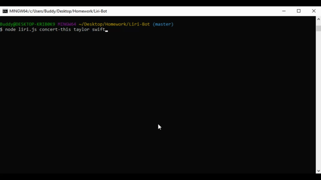
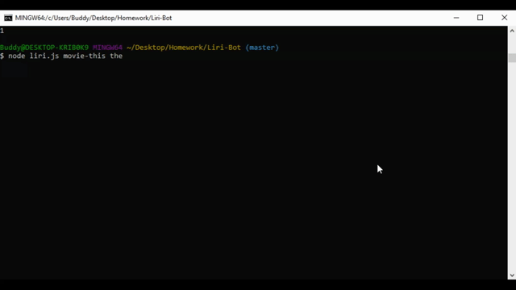
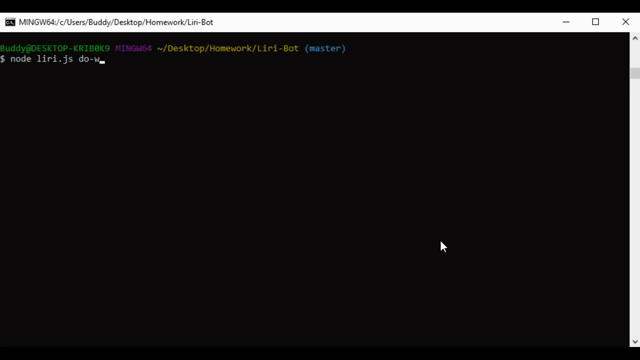

<h1>LIRI-BOT</h1>


<hr>

Author: Vance Newberry


<hr>

<h2> Project overview</h2>
LIRI is a CLI(command line interface) app that takes in search values and returns data from the following APIs and npms: Bandsintown, Spotify and OMDb.
<hr>

<h2> Use Cases </h2>

In the terminal 

- ```node liri.js concert-this "artist/band name here"``` returns info gathered from bandsintown on a specific artist/band. 

- ```node liri.js spotify-this-song "song name here"``` to return song info from Spotify.

- ```node liri.js movie-this "movie name here"``` to return movie info from OMDb. 

- ```node liri.js do-what-it-says``` executes a function set in a local text file.


<hr>

<h2>Dependencies</h2>

[Node.js](https://nodejs.org/en/)

[fs](https://www.npmjs.com/package/fs)

[dotenv](https://www.npmjs.com/package/dotenv)

[Bandsintown API](http://www.artists.bandsintown.com/bandsintown-api)

[OMDb API](http://www.omdbapi.com/)

[Spotify API](https://developer.spotify.com/documentation/web-api/)

[Moment](https://www.npmjs.com/package/moment)

<hr></hr>

<h4>Overview of code</h4>
<h6>files</h6>
-  package.json  

- .gitignore file

- keys.js
- .env

-  random.txt 

-  liri.js 


<h6>steps</h6>
- gather command line arguments

- switchCase(); switch statement holding:
  - concert-this
      bandsInTown();
  - spotify-this-song
  - movie-this
  - do-what-it-says
  
<h6>functions</h6>
- bandsInTown();
  - declare artist variable as parameter
  - request url with axios
  - return info 
  

- spotifyThis();
  - declare song variable as parameter
  - use spotify npm to request a response
  - return info 

- movieThis();
  - set subject variable as parameter
  - apply a default case
  - request url with axios
  - return info

- doWhatItSays();
  - read and return information in random.txt by utilizing if statement

- display();
  - append information to log.txt


